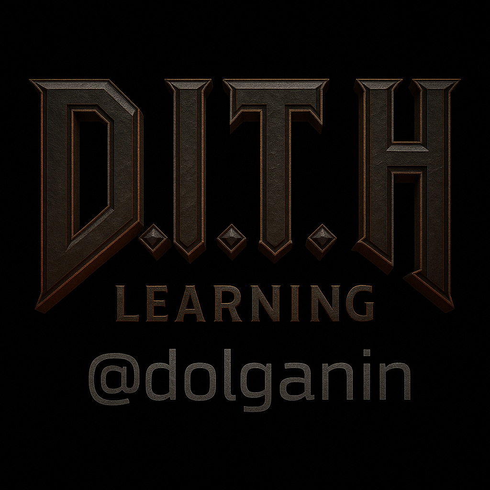
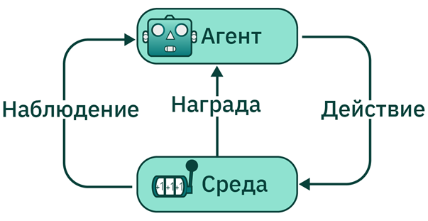
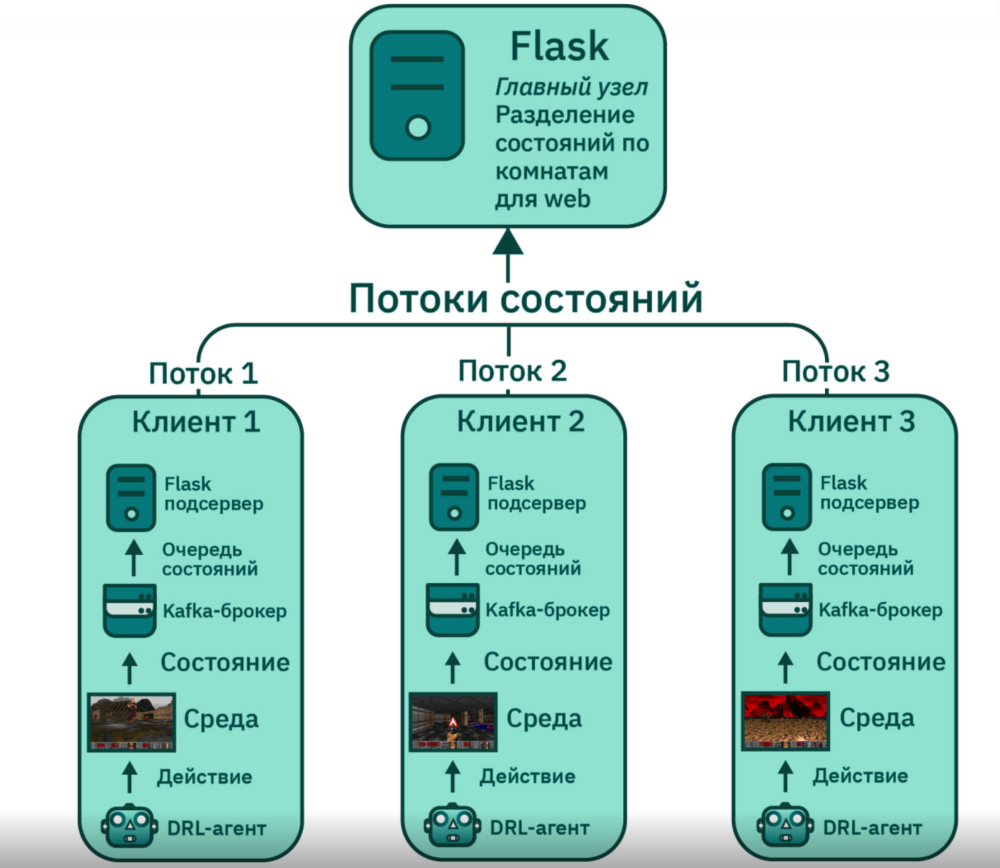

<p align="center">
  
</p>

# D.I.T.H. LEARNING

Репозиторий предназначен исключительно для обучения агента с подкреплением в модифицированной среде Doom. Содержит инфраструктуру для поднятия среды обучения, системы трансляции, логирования поведения и возврата весов модели. Разработка велась в рамках ВКР НГУ (2024–2025).

Основа обучения — алгоритм PPO с адаптацией под сложные среды. Ранее использовался IEM-PPO, но позже был исключён. Для обучения применяется форк VizDoom — [DoomITH](https://github.com/dolganin/DoomITH), а также специализированная карта для обучения и (потенциального) сбора статистики — [coNNquest](https://github.com/dolganin/coNNquest).

---

## Основные компоненты

- DoomITH: модифицированный VizDoom с доработанным API для обучения агентов.
- ForwardNetwork: ResNet34 для визуального кодирования среды.
- PolicyNetwork / ValueNetwork: трансформеры, обрабатывающие закодированное состояние.
- Flask + Kafka: система трансляции среды и потоковых данных.
- Механизм ансамблирования стратегий: «Пацифист», «Нормальный», «Штурмовик».

---

<p align="center">
  
</p>

---

## Установка

```bash
git clone https://github.com/dolganin/bachelor_degree.git
cd bachelor_degree
docker-compose up --build -d
```

Также требуется установка системных зависимостей:

```bash
sudo apt update && sudo apt install -y g++ gcc cmake make libsdl2-dev libboost-all-dev
```

---

## Структура проекта

```shell
base/                   # Базовые модули
configs/                # YAML-конфиги
main.py                 # Главный файл запуска
ppo_with_curiosity/     # Реализация агента и тренировки
scenarios/              # Doom сценарии
server_consumer/        # Сервер трансляции
utilities/              # Вспомогательные скрипты
weights/                # Весы моделей
```

---

## Запуск

Пример команды запуска:
```bash
python main.py --yaml ppobase_config.yaml --runname experiment_1 --weights model_weights --debug --test --timer 10
```

---

## Конфигурация (YAML)

```yaml
learning_parameters:
  learning_rate: 0.003
  discount_factor: 0.96
  train_epochs: 100
  frame_repeat: 96

ppo_parameters:
  clip_param: 0.2
  entropy_coef: 0.1
  embedding_dim: 120
  num_heads: 8
  num_layers: 6

env_parameters:
  resolution: [120, 130]
```

---

---

<p align="center">
  
</p>

---

## Лицензия

Для исследовательских целей.
